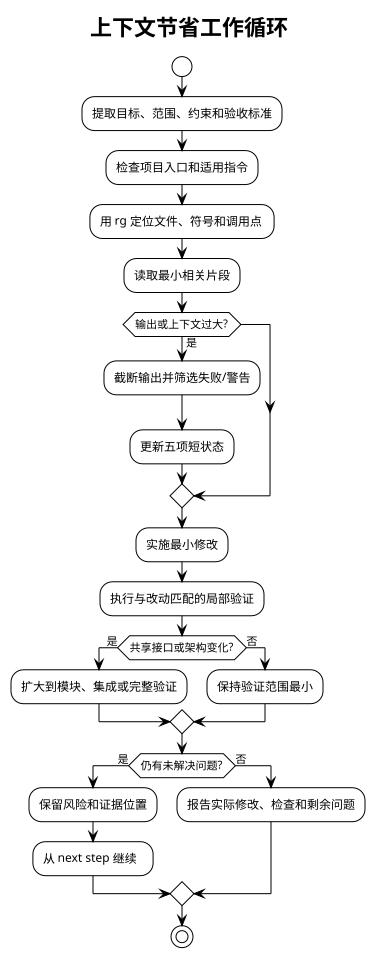

# Context Efficiency 使用与设计说明

## 目标

这个 skill 面向需要多轮工具调用的编码任务。它把上下文当作有限的工作集：只加载当前决策所需的信息，及时丢弃原始日志和重复探索，并始终保留能够恢复工作的最小状态。

它优化的是任务推进过程，不是把用户要求的交付内容强行截短。用户明确要求完整文件、日志、差异或逐字内容时，应优先满足该要求。

## 何时使用

适合以下场景：

- 需要搜索多个文件、追踪调用关系或阅读较大代码库。
- 调试、迁移或实现功能需要跨多个里程碑持续推进。
- 测试、构建或命令输出可能很大，但当前只需要失败原因或摘要。
- 任务会被中断、交接，或需要在较长对话中恢复。

不适合用来替代需求澄清、代码审查、完整测试、隐私/安全审计，或用户明确指定的输出格式。

## 工作循环

1. **定义工作集**：提取目标、范围、验收标准、不可变约束和已知状态。缺失信息只做最小合理假设，并留下记录。
2. **定位而非倾倒**：先检查项目入口和指令，再用 `rg`/`rg --files` 找到文件、符号、匹配行和调用点；之后才读取相关片段。
3. **限制输出**：未知命令和大日志默认限制到约 4000 字符，例如 `COMMAND 2>&1 | head -c 4000`。需要更多信息时，先筛选失败、警告或特定模式，再扩大范围。
4. **最小化修改**：明确受影响文件和接口不变量后再补丁；避免把无关重构混入当前任务。
5. **按风险验证**：从局部语法/lint 到定向单元测试，再到模块、集成或完整测试；只有共享接口、架构或发布要求变化时才扩大范围。
6. **更新状态**：每个里程碑只记录变化后的事实、决策、风险和下一步，不复制已经理解的代码或完整命令输出。

流程图：



备用 PNG：[context-efficiency-workflow.png](diagrams/context-efficiency-workflow.png)；对应的 PlantUML 源文件：[context-efficiency-workflow.puml](diagrams/context-efficiency-workflow.puml)。

## 工作状态模板

长任务使用以下五项短记录。每项只保留能影响下一步的内容：

```text
current goal: 当前要交付的结果
completed work: 已完成的文件、检查和结论
important decisions: 采用的方案、范围假设和接口不变量
unresolved issues: 未解决的问题、风险或环境阻塞
next step: 下一项可直接执行的动作
```

路径、符号、行号、失败信息和用户约束应保留在对应字段中；原始日志不必保留。编辑文件或发现新证据后更新状态，未变化时不要重复写一遍。

## 压缩上下文时的取舍

上下文膨胀时，按以下顺序压缩：

1. 停止继续读取，先写出五项状态。
2. 移除重复输出、过时假设和已解决分支。
3. 保留当前结论的最小证据位置，以及所有未解决风险。
4. 从 `next step` 恢复，而不是重新扫描整个项目。

摘要只能作为导航，不能替代关键结论所需的源片段。不能为了节省 token 而删除安全、权限、隐私、数据完整性或用户明确格式要求。

## 验证与维护

修改 skill 后运行：

```bash
python3 /root/.codex/skills/.system/skill-creator/scripts/quick_validate.py context-efficiency
```

校验通过只说明 frontmatter、命名和脚手架状态正确；还应人工确认：

- 描述能准确触发 skill，且不会吸引无关任务。
- `SKILL.md` 的规则与本说明一致，没有把可选建议写成无条件要求。
- 新增的输出上限不会覆盖用户明确的完整输出要求。
- 文档只记录当前行为，不复制完整实现或历史日志。
